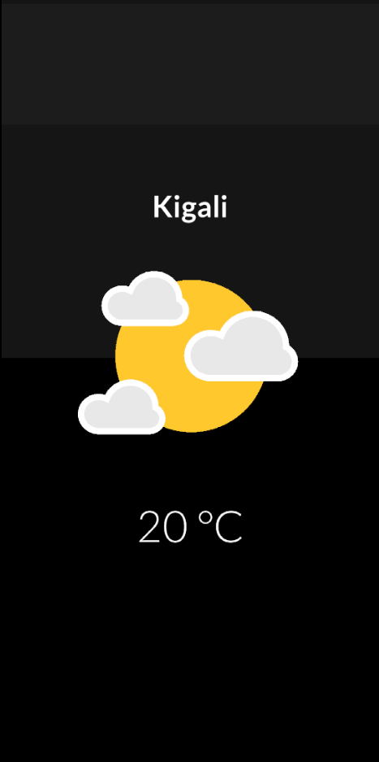

# 🌦️ Flutter Weather App

A clean, minimal weather app built with Flutter that fetches your current location and displays weather data with Lottie animations. ☁️☀️🌧️



## 🔧 Features

- 📍 Detects your current city via GPS
- 🌤️ Fetches live weather using OpenWeatherMap API
- 💡 Displays temperature and weather condition with Lottie animations
- ❗ Graceful error handling if location or internet fails

## 📱 Demo UI

| Location | Weather | Temperature |
|----------|---------|-------------|
| Kigali   | 🌤️ Clouds | 20°C        |

## 🛠️ Built With

- [Flutter](https://flutter.dev/)
- [OpenWeatherMap API](https://openweathermap.org/)
- [Lottie Animations](https://lottiefiles.com/)
- [location](https://pub.dev/packages/location)
- [geocoding](https://pub.dev/packages/geocoding)
- [http](https://pub.dev/packages/http)

## 🧠 Structure

```bash
lib/
├── main.dart
├── models/
│   └── weather_model.dart
├── services/
│   └── weather_service.dart
├── pages/
│   └── weather_page.dart
├── utils/
│   └── weather_utils.dart
assets/
├── sunny.json
├── cloudy.json
├── rainy.json
├── thunder.json
└── screenshot.png
